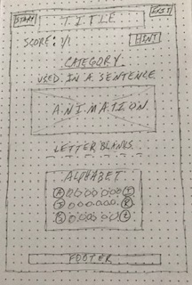

# Hangman-Game

My Project 1 is a modified version of Hangman. 

## Links
*Game Link: <not-hangman.netlify.com>
*Trello Kanban: https://trello.com/b/6fIfHe99/not-hangman 

## Technologies Used:
*Languages - HTML5, CSS, Javascript, jQuery
*Project Planning & User Stories - Trello

## Features:
*Shows number of tries user has left and decreases with each wrong guess
*Populates correct letter choices on the screen as keyboard is clicked
*Changes correct alphabet keys to green and incorrect to red
*Disables alphabet keys once clicked 
*Clear button resets the game by refreshing the page

## Wireframe:

## Works Cited:
Sticky Footer Code:
https://css-tricks.com/snippets/jquery/jquery-sticky-footer/ 

## Future Release Features:
*Image that moves across the screen with each wrong letter guess
*Multiple word categories

